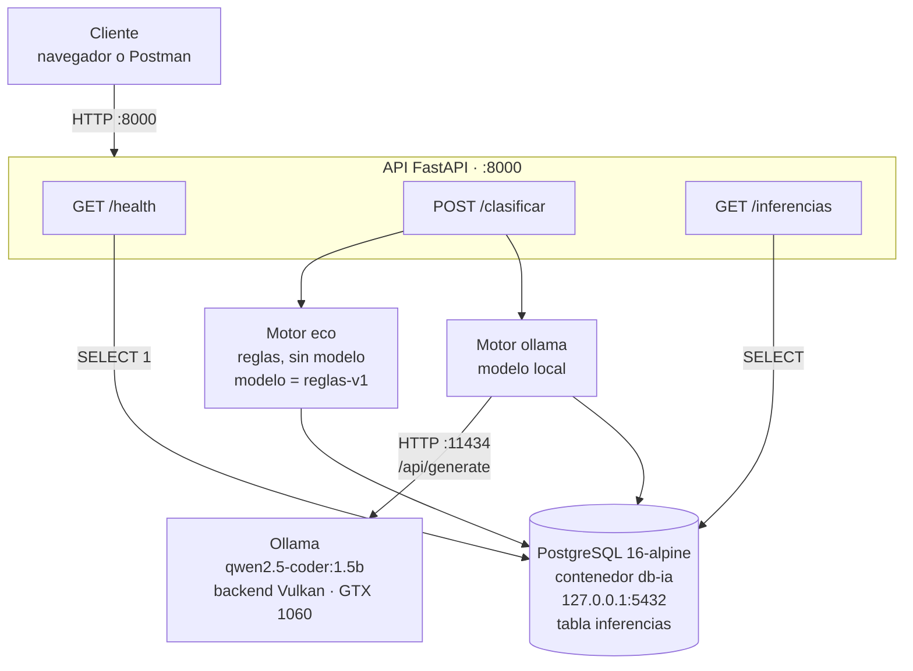

# Manual técnico

Documento vivo: se completa a lo largo de las cinco semanas del proyecto.

## 1. Arquitectura



### Componentes y puertos

| Componente | Dónde corre | Puerto | Expuesto a |
|---|---|---|---|
| API FastAPI | Proceso local (semana 3: contenedor) | 8000 | localhost |
| PostgreSQL | Contenedor `db-ia` | 5432 | **solo** 127.0.0.1 |
| Ollama | Servicio systemd del host | 11434 | **solo** 127.0.0.1 |

### Flujo de una petición

1. El cliente envía `POST /clasificar` con `{"texto": "...", "motor": "eco|ollama"}`.
2. Si no se indica `motor`, se usa `MOTOR_POR_DEFECTO` del archivo `.env`.
3. El motor **eco** aplica expresiones regulares sobre el texto en minúsculas y
   devuelve el primer tipo que coincida; si ninguno coincide, devuelve `chore`.
4. El motor **ollama** arma un prompt de clasificación y consulta el modelo local
   por HTTP con `temperature: 0` (respuesta determinista) y `num_ctx: 2048`
   (valor del perfil A según el Anexo A de la guía).
5. Se mide la latencia, se registra la inferencia en PostgreSQL y se devuelve el
   resultado en JSON.

## 2. Seguridad

### Puertos expuestos y por qué

Ningún servicio se publica hacia la red. PostgreSQL se mapea con
`-p 127.0.0.1:5432:5432` en lugar de `-p 5432:5432`: la diferencia es que el
segundo escucharía en todas las interfaces y cualquier equipo de la red local
podría intentar autenticarse contra la base de datos. Ollama, por su parte, ya
viene configurado por defecto en `OLLAMA_HOST=127.0.0.1`.

El único puerto pensado para recibir tráfico es el **8000** de la API, y aun así
durante el desarrollo se limita a localhost.

### Roles de base de datos

| Rol | Privilegios | Para qué se usa |
|---|---|---|
| `postgres` | Superusuario | Solo tareas administrativas: crear la tabla, ejecutar `init.sql`, respaldos |
| `app_ia` | `CONNECT`, `USAGE` en el esquema, `SELECT` e `INSERT` en `inferencias`, `USAGE`/`SELECT` en la secuencia | Es el único rol que usa la aplicación |

`app_ia` **no** tiene `DELETE`, `UPDATE`, `DROP` ni `TRUNCATE`. La consecuencia
práctica es que el historial de inferencias es *append-only*: aunque un atacante
lograra inyectar SQL a través de la API, no podría borrar ni alterar los registros
previos, que son la evidencia de lo ocurrido.

Verificación realizada:

```
app_ia → DELETE FROM inferencias;  →  ERROR: permission denied for table inferencias
app_ia → DROP TABLE inferencias;   →  ERROR: must be owner of table inferencias
app_ia → INSERT INTO inferencias;  →  OK
```

Nótese que son dos mecanismos distintos: el `DELETE` lo bloquea el sistema de
privilegios, y el `DROP` lo bloquea la propiedad del objeto, que pertenece a
`postgres`.

### Manejo de secretos

Las credenciales viven únicamente en el archivo `.env`, que está listado en
`.gitignore` y nunca se sube al repositorio. El código las lee con
`python-dotenv` mediante `os.getenv()`; no hay una sola contraseña escrita en
`app/main.py`.

El repositorio incluye `.env.example` como plantilla. Contiene valores
funcionales de desarrollo para que el proyecto se levante copiando el archivo
(requisito 1 del Anexo C), con una advertencia explícita de que en un despliegue
real deben reemplazarse por valores generados aleatoriamente y administrarse con
un gestor de secretos.

Antes de cada commit se comprueba con `git check-ignore -v .env` que el archivo
sigue efectivamente ignorado.

### Qué hacer si se filtra una contraseña

1. **Rotar de inmediato.** Cambiar la contraseña del rol afectado
   (`ALTER ROLE app_ia WITH PASSWORD '<nueva>'`) y actualizar el `.env`. Esto va
   primero: mientras la credencial siga siendo válida, todo lo demás es
   secundario.
2. **Revocar sesiones activas** con `pg_terminate_backend`, porque una conexión
   ya establecida sobrevive al cambio de contraseña.
3. **Purgar el historial de Git** si la credencial llegó a subirse, con
   `git filter-repo` o BFG, y forzar la reescritura en el remoto. Borrarla en un
   commit nuevo **no** sirve: sigue accesible en el historial.
4. **Asumirla comprometida para siempre.** Un repositorio público es indexado por
   bots en minutos; rotar es obligatorio aunque el commit haya durado poco.
5. **Revisar los registros** en busca de accesos no reconocidos y documentar el
   incidente.

## 3. Decisiones de entorno

El equipo de desarrollo usa **Arch Linux**, mientras que la guía está escrita para
Ubuntu. Las adaptaciones y su justificación están documentadas en
[`informe-tecnico.md`](informe-tecnico.md), incluida la sustitución de
`ollama-cuda` por `ollama-vulkan` por la arquitectura Pascal de la GPU.
